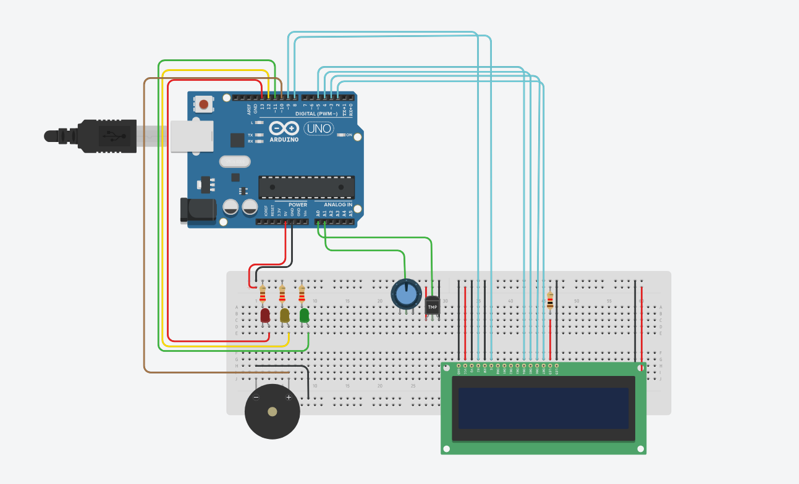

# Global Solution - Edge Computing 🌊🚨

## Integrantes 👤
<ul>
<li>Caio Suzano Ferreira da Silva: RM 554763</li>
<li>Lucas Vasquez Silva: RM 555159</li>
<li>André Nakamatsu Rocha: RM555004</li> 
</ul>

## O Projeto 📃

O projeto baseia-se em sensores de pH e Temperatura para monitoramento da água do mar. Esses valores são armazenados em um banco de dados (GS - Python)

## Instruções de uso
Use o medidor de temperatura e potenciômetro para ajustar os valores e verificar no LCD

## Requisitos
- Biblioteca Liquid Crystal (LCD)

## Dependências 🛠️
- Arduino UNO
- Display LCD
- 3 LEDS
- 4 Resistores
- Potenciômetro
- Sensor de temperatura
- Buzzer
- 27 Fios

## O Código 💻
```C++
#include <LiquidCrystal.h>

// Pinos de conexão
const int BUZZER_PIN = 10;
const int GREEN_LED_PIN = 11;
const int YELLOW_LED_PIN = 12;
const int RED_LED_PIN = 13;
const int TEMP_SENSOR_PIN = A0;
const int PH_SENSOR_PIN = A1;
const int RS = 9, EN = 8, DB4 = 5, DB5 = 4, DB6 = 3, DB7 = 2;

// Valores de referência
const int PH_OK_MIN_LEVEL = 8;
const int PH_OK_MAX_LEVEL = 9;
const int PH_YELLOW_MIN_LEVEL = 6;
const int PH_YELLOW_MAX_LEVEL = 7;
const int PH_RED_LOW = 6;
const int PH_RED_HIGH = 10;
const float TEMP_OK_MIN_LEVEL = 10.0;
const float TEMP_OK_MAX_LEVEL = 20.0;
const float TEMP_YELLOW_LEVEL = 25.0;
const float TEMP_RED_LEVEL = 30.0;

LiquidCrystal lcd(RS, EN, DB4, DB5, DB6, DB7);

void setup() {
  Serial.begin(9600); // Inicializa a comunicação serial
  lcd.begin(16, 2); // Inicia o LCD com 16 colunas e 2 linhas
  pinMode(BUZZER_PIN, OUTPUT);
  pinMode(GREEN_LED_PIN, OUTPUT);
  pinMode(YELLOW_LED_PIN, OUTPUT);
  pinMode(RED_LED_PIN, OUTPUT);
}

void loop() {
  // Leitura dos sensores e mapeamento dos valores
  int phRawValue = analogRead(PH_SENSOR_PIN);
  float phValue = phRawValue * (14.0 / 1023.0); // Conversão direta do valor analógico para pH
  int phIntValue = (int)phValue; // Converte o valor de pH para inteiro

  int tempRawValue = analogRead(TEMP_SENSOR_PIN);
  // Converte a leitura do sensor para temperatura (0 a 40 graus)
  float temperatureValue = (tempRawValue / 1023.0) * 40.0;
  temperatureValue = map(tempRawValue, 20, 358, 0, 40);

  // Imprime os valores lidos no monitor serial
  Serial.print("Raw Temp Value: ");
  Serial.println(tempRawValue);
  Serial.print("Temperatura: ");
  Serial.print(temperatureValue, 1); // Mostra a temperatura com uma casa decimal
  Serial.println(" C");

  // Alterna entre a exibição do pH e da temperatura a cada 5 segundos
  displayPH(phIntValue);
  delay(5000);
  displayTemperature(temperatureValue);
  delay(5000);
}

void displayPH(int phValue) {
  lcd.clear();
  lcd.setCursor(0, 0);
  lcd.print("pH: ");
  lcd.print(phValue); // Mostra o valor do pH sem casas decimais

  if (phValue < PH_RED_LOW) {
    lcd.setCursor(0, 1);
    lcd.print("Subst. Acidas");
    digitalWrite(RED_LED_PIN, HIGH);
    digitalWrite(YELLOW_LED_PIN, LOW);
    digitalWrite(GREEN_LED_PIN, LOW);
    tone(BUZZER_PIN, 1000); // Aciona o buzzer com frequência de 1000 Hz
  } else if (phValue > PH_RED_HIGH) {
    lcd.setCursor(0, 1);
    lcd.print("Subst. Bases");
    digitalWrite(RED_LED_PIN, HIGH);
    digitalWrite(YELLOW_LED_PIN, LOW);
    digitalWrite(GREEN_LED_PIN, LOW);
    tone(BUZZER_PIN, 1000); // Aciona o buzzer com frequência de 1000 Hz
  } else if (phValue >= PH_YELLOW_MIN_LEVEL && phValue <= PH_YELLOW_MAX_LEVEL || phValue == 10) {
    lcd.setCursor(0, 1);
    lcd.print("Alerta! Subst");
    digitalWrite(YELLOW_LED_PIN, HIGH);
    digitalWrite(RED_LED_PIN, LOW);
    digitalWrite(GREEN_LED_PIN, LOW);
    tone(BUZZER_PIN, 500); // Aciona o buzzer com frequência de 500 Hz
  } else if (phValue >= PH_OK_MIN_LEVEL && phValue <= PH_OK_MAX_LEVEL) {
    lcd.setCursor(0, 1);
    lcd.print("pH Ideal");
    digitalWrite(GREEN_LED_PIN, HIGH);
    digitalWrite(YELLOW_LED_PIN, LOW);
    digitalWrite(RED_LED_PIN, LOW);
    noTone(BUZZER_PIN); // Desliga o buzzer
  }
}

void displayTemperature(float temperatureValue) {
  lcd.clear();
  lcd.setCursor(0, 0);
  lcd.print("Temp: ");
  lcd.print(temperatureValue, 1); // Mostra o valor da temperatura com uma casa decimal
  lcd.print(" C");

  if (temperatureValue > TEMP_RED_LEVEL) {
    lcd.setCursor(0, 1);
    lcd.print("Temp. Alta!");
    digitalWrite(RED_LED_PIN, HIGH);
    digitalWrite(YELLOW_LED_PIN, LOW);
    digitalWrite(GREEN_LED_PIN, LOW);
    tone(BUZZER_PIN, 2000); // Aciona o buzzer com frequência de 2000 Hz
  } else if (temperatureValue > TEMP_YELLOW_LEVEL) {
    lcd.setCursor(0, 1);
    lcd.print("Temp. preocupante!");
    digitalWrite(YELLOW_LED_PIN, HIGH);
    digitalWrite(RED_LED_PIN, LOW);
    digitalWrite(GREEN_LED_PIN, LOW);
    tone(BUZZER_PIN, 1500); // Aciona o buzzer com frequência de 1500 Hz
  } else if (temperatureValue < TEMP_OK_MIN_LEVEL || temperatureValue > TEMP_OK_MAX_LEVEL) {
    lcd.setCursor(0, 1);
    lcd.print("Temp. congelante");
    digitalWrite(YELLOW_LED_PIN, HIGH);
    digitalWrite(RED_LED_PIN, LOW);
    digitalWrite(GREEN_LED_PIN, LOW);
    tone(BUZZER_PIN, 1500); // Aciona o buzzer com frequência de 1500 Hz
  } else {
    lcd.setCursor(0, 1);
    lcd.print("Temp. Aceitavel");
    digitalWrite(GREEN_LED_PIN, HIGH);
    digitalWrite(YELLOW_LED_PIN, LOW);
    digitalWrite(RED_LED_PIN, LOW);
    noTone(BUZZER_PIN); // Desliga o buzzer
  }
}
```
